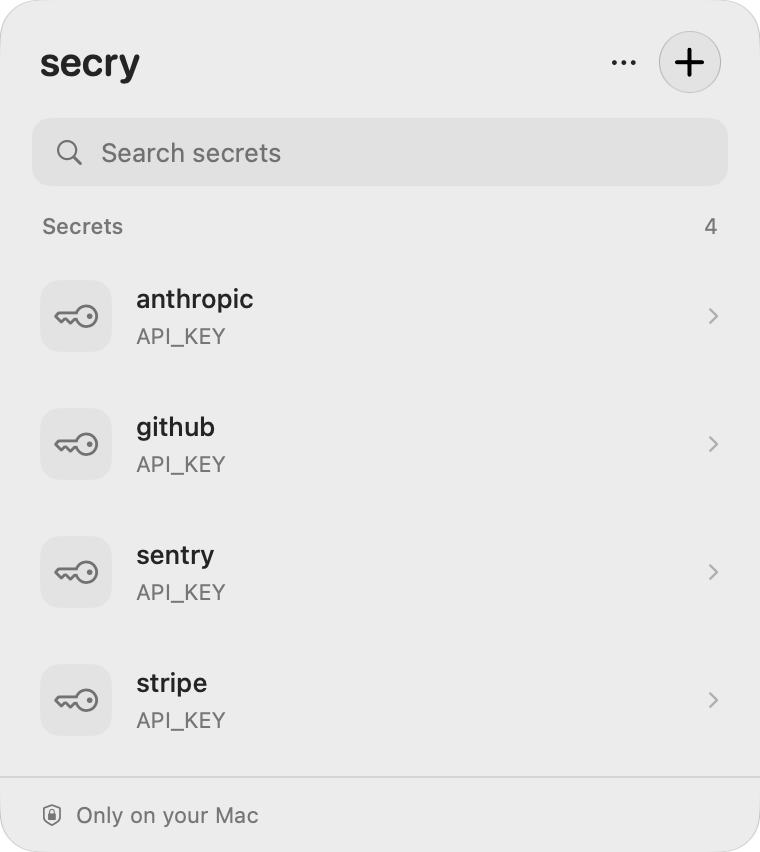
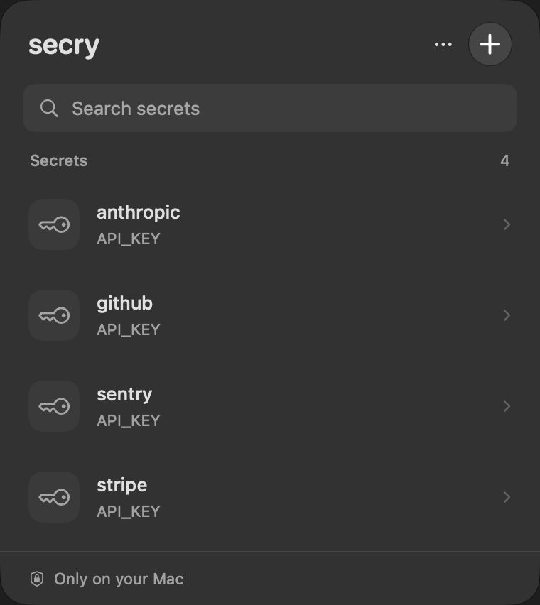

<p align="center">
  
</p>
<h1 align="center">secry</h1>
<p align="center"><strong>Your secrets stay on your Mac.</strong><br>Give your tools temporary access. Keep credentials out of the conversation.</p>
<p align="center">
  <a href="https://github.com/rovnyart/secry/actions/workflows/ci.yml"></a>
  
  
  <a href="LICENSE"></a>
</p>

A small native menu bar vault for developers and their agents. Store named secret
sets in macOS Keychain, allow access for 15 minutes, and run a command with those
values injected into its environment. No account. No server. No subscription.

<p align="center">
  
  &nbsp;
  
</p>
<p align="center"><sub>Actual application views with disposable demonstration data.</sub></p>

## Why secry?

- **Local by design.** Secrets live in your Keychain; access grants stay in memory.
- **A short access window.** Allow a set for 15 minutes. Close access manually or
  automatically on edit, sleep, screen lock, or session switch.
- **Made for command-line tools.** Inject environment variables into a child
  process without pasting credentials into a chat or command arguments.
- **Bring your own format.** Paste `.env`, JSON with string values, or private text.
- **Native macOS.** SwiftUI, light and dark appearances, and Liquid Glass on macOS 26+.

## Install

The first signed release is being prepared. Until the release and Homebrew cask
are published, [build from source](#build-from-source).

Requires macOS 14 Sonoma or newer. The release build includes Apple Silicon and
Intel architectures. Intel and macOS 14 runtime behavior have not yet been tested.

## Use it

1. Open secry and click the key in your menu bar.
2. Add a set such as `sentry`, then paste its environment variables.
3. Open the set and choose **Allow & copy for agent**.
4. Give the copied instruction to your agent, or run the tool yourself:

```sh
secry list
secry run sentry -- sentry-cli releases list
```

The copied instruction contains the local executable path and set name, not the
secret values. Plain text is exposed as `SECRET`. `run` replaces the CLI process
with the requested command, preserving its exit status.

Right-click the menu bar icon to open secry, close all agent access, or quit.
The app must be running for the CLI to access the vault.

## Understand the boundary

An open grant applies to **processes running as your macOS user**, not one verified
AI agent. A command receiving a secret can still print, retain, or transmit it.
Revocation blocks future requests; it cannot retrieve values already delivered.

Set names and variable names are visible through `secry list` even with access
closed. The running app holds the vault in memory. Clipboard managers can retain
explicitly copied secrets. Read the full [security model](SECURITY.md).

## Build from source

With Xcode 26 or newer installed:

```sh
git clone https://github.com/rovnyart/secry.git
cd secry
./scripts/build.sh
open .build/Build/Products/Debug/secry.app
.build/bin/secry --help
```

No third-party dependencies. Local development builds use ad-hoc signing and may
ask again for Keychain access after rebuilding.

```sh
./scripts/test.sh             # Parser and isolated Keychain/bridge tests
./scripts/preview.sh          # Interactive UI with memory-only fixtures
./scripts/release.sh build    # Universal local Release build
```

See [development and visual checks](docs/DEVELOPMENT.md),
[release signing](docs/RELEASING.md), and [contributing](CONTRIBUTING.md).

## License

[MIT](LICENSE) · Built by [rovnyart](https://github.com/rovnyart).
